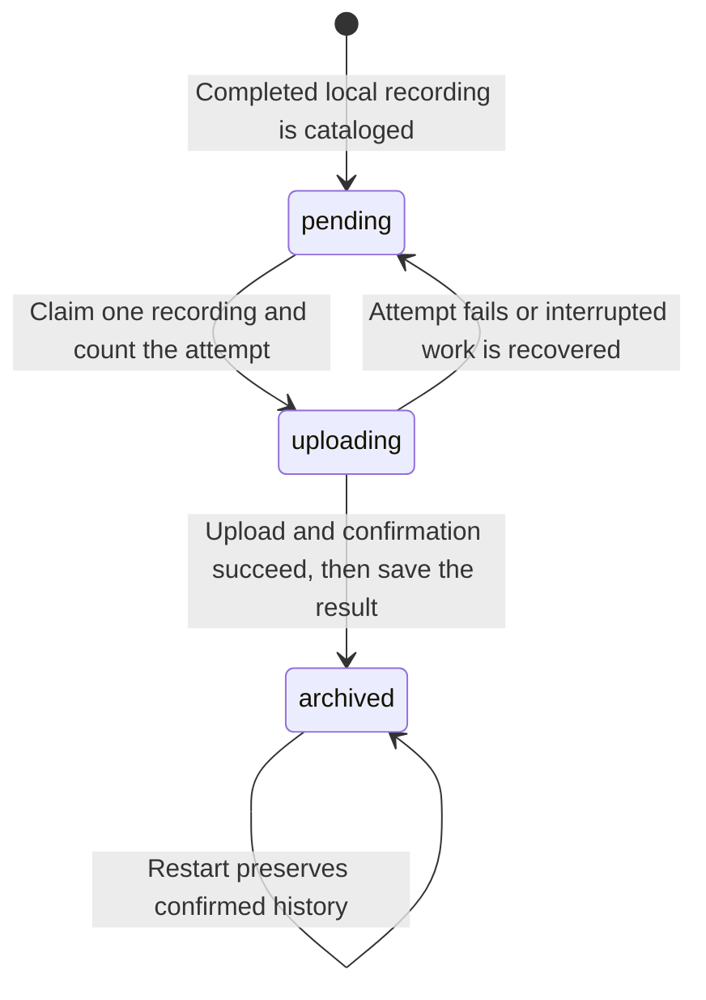

# Recordings when an upload process crashes

This reliability check covers the handoff between a saved recording, the local database and the object store. A fast live picture does not tell us whether saved footage can recover from an interrupted upload.

## The problem

Imagine uploading `clip-42.mp4`. The store saves the whole file, but its reply never reaches the uploader. The uploader cannot conclude that the file is absent. Starting over with a different object name would create another logical recording. Marking the recording archived without checking would risk reporting a copy that does not exist.

The selected design keeps the local file, remembers unfinished work in SQLite and repeats the upload using the same object name. The object name includes the recording's session, filename and SHA-256 checksum. That checksum identifies its exact bytes. A retry may send the bytes again, but should end with one object for that recording.

This applies the partial-failure and uncertain-outcome ideas discussed in [DDIA, first edition, chapter 8](https://www.oreilly.com/library/view/designing-data-intensive-applications/9781491903063/ch08.html). A repeatable request with the same intended effect is called **idempotent**. The [Idempotent Receiver pattern](https://martinfowler.com/articles/patterns-of-distributed-systems/idempotent-receiver.html) describes why lost replies make safe retries necessary. Our choice of a recording-derived object name is an application of that idea.

## The three pieces of state

| Piece | What it knows | What it cannot establish alone |
| --- | --- | --- |
| Local recording file | The saved bytes are available for another attempt. | Whether the remote store received them. |
| SQLite catalog | The recording identity, attempt count and last confirmed upload state. | What happened remotely after a reply was lost. |
| Object store | Which bytes currently exist under an object name. | Whether the uploader recorded its success locally. |

SQLite can commit related database changes together. It cannot make a remote HTTP upload part of that same transaction. The gap between those operations must therefore be recoverable.



The uploader checks the local file's checksum before sending it. The request includes a transfer checksum; confirmation checks the stored size and recording metadata before the database is marked archived. The real R2 service documents immediate read-after-write consistency through its direct API. That helps confirmation, but does not remove the possibility of a lost reply. [R2 consistency](https://developers.cloudflare.com/r2/reference/consistency/).

## Test plan and coverage target

The target is coverage of the important failure boundaries, rather than a percentage of code lines. Each selected crash boundary must demonstrate both the uncertain state before recovery and a correct result after a fresh uploader starts.

| Scenario | Test type | Evidence required |
| --- | --- | --- |
| Worker dies after only part of the request body reaches the store | Subprocess and HTTP integration | Positive but incomplete received-byte count; no completed object; catalog is not archived; restart preserves the local file and completes the same recording. |
| Store receives the whole file but withholds its reply, then the worker dies | Subprocess and HTTP integration | Complete object exists while SQLite remains uploading; restart repeats the same key and ends with matching bytes and one logical object. |
| The SDK receives a successful confirmation while SQLite writes are held | Subprocess and database integration | The real SDK has accepted HEAD and the parent holds a database write lock before death; reopening the database exposes unfinished work; recovery completes it without changing identity. This does not prove that the child attempted its SQL update before death. |
| A confirmed upload is encountered after restart | Restart regression | A third worker completes its first queue scan, preserves archived history and makes no new upload or confirmation request. |
| Shutdown occurs while the worker waits for the database | Deterministic cancellation regression | Observe a real database-connection wait, then cancel; the worker stops cleanly without falsely reporting a database failure. |
| Local bytes change, confirmation disagrees, or a file escapes the recording directory | Existing integrity and boundary tests | Refuse success; never label unverified content archived. |

The fixture must wait for observed events before killing a child. A timer alone cannot prove which operation was interrupted. It must also check the child's exit, the persisted catalog and the object bytes; a returned error alone is insufficient.

## Run the checks

From the repository root:

```sh
go test ./internal/lab -run '^TestArchiveRecoveryAfterProcessKill$' -count=1 -v
go test -race ./internal/lab -run '^TestArchiveRecoveryAfterProcessKill$' -count=1 -v
go test ./internal/lab -run '^TestArchiveCancellationDuringCatalogWait$' -count=1 -v
```

Go's race detector checks for unsafe concurrent memory access. It slows execution, which can also expose timing bugs. Each test prints the bytes received before the worker was killed. A passing partial-upload case requires that number to be greater than zero and less than the full file size; reading one piece before killing the sender would not be enough, because the network could already have buffered the rest.

All three cases reopen SQLite before recovery and require one unfinished recording with one attempt. A fresh worker must then finish with two attempts, one confirmed object containing the original bytes, and an unchanged local file. The tests do not manually repair upload state or reset retry times.

## What this check found

The existing upload-recovery design passed all three process-crash cases on Go 1.25.5, macOS arm64. The partial-transfer case received 32,768 of 2,162,688 bytes before process death. Each case finished with two upload attempts, one confirmed object and no new network operation on a third startup.

Running with the race detector exposed a separate shutdown timing bug. Cancellation could interrupt a database call, and the worker would incorrectly report that the catalog was unavailable. The fix recognizes cancellation at those database boundaries and returns normally. Tests reserve the database's only connection, observe the worker waiting for it, then cancel during startup and during a later queue scan.

To check that the recovery tests can reject a broken implementation, we disabled interrupted-upload recovery in a disposable source copy. The partial-transfer test failed: after restarting, its recording remained pending and nothing was archived. The two cancellation cases also fail against the original shutdown code and pass with the fix. These negative checks altered only the test copy.

The full Go test suite and `go vet ./...` passed. Detailed development-run output is kept in the ignored `reports/` directory; the source tests above can be rerun from a fresh checkout.

## Scope

The process tests use the real uploader, AWS SDK and SQLite catalog, with fake credentials and an object-store fixture on loopback. They create disposable local files and kill only child processes started by the test. They do not load the normal private settings, contact R2, alter the Mac's network connection or restart live media services.

The fixture represents selected HTTP failures. It does not reproduce all of R2, a long internet outage, loss of power or disk hardware failure. Byte fixtures test transfer and recovery; they do not prove that video frames can be decoded. Existing media acceptance and real-bucket checks provide separate evidence for those other paths.

## Earlier evidence and remaining work

Before this milestone, local tests already covered a complete upload followed by an HTTP error, an in-process retry using the same object name, graceful cancellation, and catalog recovery after a separate process exited. Those pieces had not yet been combined into a forced process death at a known upload boundary followed by successful recovery in another process.

Remaining stages include a measured real-internet outage, recording behavior at the storage limit, independent playback checks of archived footage, and interrupted disk writes on disposable equipment. A checksum confirms saved bytes; a separate video-health check is needed to detect damaged compressed frames.
