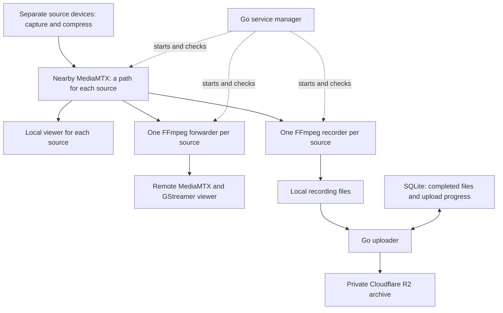

# Constraints and language choice

**Decision date:** 11 September 2026. **Scope:** a video and recording service for multiple source devices. **Status:** Go, source registration, SQLite and optional R2 uploading are implemented; two-source media acceptance and wider reliability measurements are still incomplete.

We choose Go for the custom service manager and recording uploader, use established video software for the media, and use SQLite for durable local progress. Cloudflare R2 stores completed recordings. This document explains the requirements behind those choices.

## What the research establishes

The sources describe operating conditions. They do not prescribe a language or supply our hardware and performance limits.

| Evidence | What it supports for our project |
| --- | --- |
| [UNSW, 16 March 2026](https://www.unsw.edu.au/news/2026/03/world-first-report-reveals-the-realities-of-drone-warfare-in-ukr) describes extensive drone use by both sides, rapid changes, and continuing dependence on people and technical support. | A camera feed is a reasonable part of a learning project. We need replaceable components and understandable operation. A successful video demonstration cannot validate an entire drone system. |
| [OHCHR, 29 June 2026](https://ukraine.un.org/en/318327-attacks-against-ukraine%E2%80%99s-energy-infrastructure-and-update-human-rights-situation-ukraine-1), covering December 2025–May 2026, documents damaged electricity facilities and extensive outages. | Power can disappear abruptly. Saving, restarting and recovering incomplete work are core requirements. |
| [ITU's Ukraine programme](https://www.itu.int/en/ITU-D/Regional-Presence/Europe/Pages/Projects/2022/Council%20Resolution%20on%20Ukraine%20-%20Coordination%20and%20Implementation/Council-Resolution-on-Ukraine---Coordination-and-Implementation.aspx) records an urgent June 2026 need to repair damaged civilian fibre-optic infrastructure. | A working local camera connection does not imply that cloud services are reachable. Local operation needs independence from the internet. |
| [RUSI, 30 January 2025](https://www.rusi.org/explore-our-research/publications/occasional-papers/competitive-electronic-warfare-modern-land-operations), provides older background on deliberate disruption of communications and navigation. | A connection can become unavailable for reasons the application cannot repair. Our lab tests interrupted connections; it does not model radio warfare or provide countermeasures. |

These conclusions are our engineering interpretation of the reports. Phones and tablets are convenient camera sources; compatible cameras and other computers can also provide a stream. They do not reproduce aircraft movement, radio propagation, environmental qualification or every condition of active conflict. Flight control, targeting and weapons functions are outside this project's scope.

## Requirements we choose

"No room for failure" expresses how serious the consequences are. It does not make uninterrupted service physically possible. We must identify which failures we can survive, how quickly we detect others, and what data can be lost.

| Constraint | Required behaviour | Reason |
| --- | --- | --- |
| Internet disappears | An already configured system starts locally and continues local viewing and recording while the camera link, power and storage remain available. R2 uploads wait. | The remote service must not decide whether nearby equipment can work. |
| Data arrives too slowly | Limit waiting data. Show when pictures stop arriving. Keep old recordings separate from the live feed. | Sending an ever-growing queue produces increasingly old video and eventually exhausts memory. |
| Power or a process stops | Recover completed recordings and unfinished upload jobs after restart. Identify incomplete files explicitly. | A process can stop between any two writes. |
| Storage is finite | Reserve space for the operating system. Stop recording with a visible warning at the limit; preserve live viewing. Do not silently delete unuploaded footage. | Infinite retention and an indefinite outage cannot both fit on a finite disk. |
| CPU, memory and battery are limited | Forward already compressed video where possible. Bound worker counts, buffers, log sizes and upload concurrency. Measure the whole machine. | Additional compression costs processing and energy; the controller is only one consumer. |
| One part fails | A stalled uploader or failed monitoring service must not stop video. Recording and forwarding have separate lifetimes. | These jobs have different failure and recovery needs. |
| Equipment or credentials are exposed | Give each source its own identity, encrypted connection and publishing permissions. Keep archive credentials off source devices. | One compromised component should have limited access to the rest. |
| People have limited attention | Show separate source, local-view, remote-view, recording and archive states, with clear reasons for failure. | A green process indicator can hide a frozen picture. |
| Hardware and software change | Keep standard media interfaces and versioned configuration. Package dependencies, support offline installation and retain a previous working release. | Replacement equipment and recovery should not depend on live downloads. |

### Initial numerical test targets

These are deliberately chosen laboratory targets, **not reported military specifications and not measured results**. They make the design testable.

- **Sources:** begin each sender at 720p, 30 pictures per second and about 2 megabits per second. Use separate IDs and credentials for simultaneous sources. The implementation currently accepts up to four registered sources; that is a limit to test, not a proven capacity result. Larix on a phone or tablet is one possible sender.
- **Constrained host:** later test on a named Linux computer with four CPU cores, 4 GB of memory and 64 GB reserved for recordings. Test ARM64 first; validate x86-64 separately before claiming support. The Mac is the development host. No special graphics processor is required for the controller; encoding capacity needs its own measurement.
- **Controller allowance:** target less than 128 MiB of resident memory at steady load for one camera. Measure peak use during repeated failures and a large upload backlog. A language setting is not proof of a memory limit.
- **Local independence:** disconnect the internet for 30 minutes while the local camera connection remains available. Local viewing and recording should continue, with no growing in-memory upload queue.
- **Picture freshness:** on a healthy test network, target a camera-to-screen delay of at most 1.5 seconds for 95% of measured samples. Mark that no new decoded frames are arriving within two seconds of that condition. A still scene is not necessarily a failed stream.
- **Worker recovery:** target video restoration within ten seconds after a forwarding process crash, provided the source, receiver and connection are healthy. Measure restart attempts separately from successful playback.
- **Recording recovery:** aim for segments of approximately five seconds. A segment boundary alone does not guarantee five seconds of maximum loss; buffering, keyframes, file format and disk flushing all matter. Measure the actual loss before making a guarantee.
- **Load growth:** establish two simultaneous streams with separate controls, then test four cameras and twenty viewers using an explicit viewing pattern. Decoder checks alone do not prove the viewer-load target. Record per-source and whole-computer resource use.

The 64 GB storage target is for a later dedicated test host. This implementation has a 2 GB recording quota shared across all sources and pauses recording below 1 GB of free space. The later target does not authorize using 64 GB of the Mac's disk now.

At 2 megabits per second, one camera produces about **0.9 GB per hour**, or **21.6 GB per day**, before file overhead. Four cameras produce about **86.4 GB per day**. Thus 64 GB cannot retain a full day from four cameras. Storage capacity, source rate and retention must be agreed together.

Remote live video and delayed archive uploads can also compete for the same connection. If recordings arrive at 2 megabits per second but only 1 megabit per second remains for uploads, the backlog grows even though the internet is working. Show the backlog and estimated remaining recording time. Give uploads a rate limit and pause them when live delivery suffers.

## Component choices

The first Mac experiment places both MediaMTX instances on one machine. Each MediaMTX instance is shared across source paths; each source has its own recorder, forwarder and controls. All programs share power, CPU, disk and network. Independent hosts are required to test loss of a whole computer.

**The source device captures and compresses video.** The implemented input uses H.264 in MPEG-TS over SRT, with caller mode, a Stream ID and an encryption passphrase. Larix is one compatible sender; no custom mobile app is required. Other input types need adapters. A native source application would be a separate decision if an existing sender cannot meet a measured requirement.

**A source registry gives each stream a stable identity.** An ID such as `camera-02` selects its server path, viewer links, recording identity and controls. Its private guide contains only its publishing credentials. `./lab source list`, `source add` and `source guide` manage this setup; add sources while the lab is stopped. `./lab --source camera-02 profile small` changes only that source's forwarded picture. The label and source ID describe the stream without fixing a hardware brand.

**MediaMTX receives video and distributes it to readers.** It already implements the relevant media connections. We use it as a separately packaged service, not as a reason to write our controller in the same language. [MediaMTX introduction](https://mediamtx.org/docs/kickoff/introduction).

**FFmpeg records, forwards and optionally compresses a smaller version.** Copying the compressed stream avoids another round of image compression. Re-encoding decodes the image and compresses it again, trading quality, processing and delay for a lower data rate. We retain the received source locally when making a smaller remote version. This is the video that reached the computer, not the camera's uncompressed original. [FFmpeg stream copying](https://ffmpeg.org/ffmpeg.html#Streamcopy).

**Go manages services and uploads completed files.** It handles settings, health checks, restart rules, time limits and file transfer. Video frames do not travel through this custom program. The operating system must also supervise the Go service itself; otherwise a failed supervisor has nobody to restart it.

**SQLite stores durable progress.** A transaction groups related database changes so they either complete together or leave the previous state. This fits recording identities, checksums, upload states and retry scheduling. [SQLite transactions](https://www.sqlite.org/transactional.html). JSON remains useful for settings and disposable status snapshots. The database choice follows recovery requirements, even if it adds a Go dependency.

The database cannot make a local file and an R2 upload one indivisible operation. Give each recording a stable identity, check for completed but unlisted files on restart, and make retries safe. If R2 receives a file but the acknowledgement is lost, a retry must not create a different recording or overwrite unrelated footage. Do not mark a recording archived before confirming the intended object. Checksums detect content mismatch; they do not establish who recorded it. SQLite's guarantees also depend on correct storage and flushing behaviour. [SQLite atomic commits](https://www.sqlite.org/atomiccommit.html).

**R2 is the remote recording archive.** Local video does not wait for it. Use its supported S3-style interface; R2 is not identical to Amazon S3, so validate the exact upload, checksum and access-control operations we use. A second copy exists only after the upload succeeds. [R2 API compatibility](https://developers.cloudflare.com/r2/api/s3/api/). The current implementation uploaded and confirmed a 1,252,488-byte generated recording in a real private bucket; see [the check report](../reports/latest-r2-check.json). This is evidence for the basic path, not every failure scenario.

## Why Go, after considering other languages

The strongest shortlist for our custom deployed program is Go and Rust. Both can produce compiled programs for the intended computers. There is no constraint that makes Go the only correct answer.

| Language | Fit and trade-off for this job | Decision |
| --- | --- | --- |
| **Go** | Built-in process, network and cancellation tools fit independent tasks that spend much of their time waiting. Ships as a per-platform executable. Automatic memory cleanup has costs, and concurrent tasks can still share data incorrectly. | Choose for service management and uploads. |
| **Rust** | Checks many memory and shared-data mistakes before running; memory ownership avoids a garbage collector. Requires more explicit ownership and asynchronous-task design. | Strongest alternative. Prefer if tighter memory control or custom native processing becomes decisive. |
| **C and C++** | Useful for codecs, device interfaces and fine control over execution. Correct lifetimes and memory access require more care. Modern C++ can automate resource cleanup, but that alone does not prevent all memory errors. | Reuse established native media software; no new controller in these languages. |
| **Java / Kotlin on the JVM** | Suitable for reliable services. Can ship a bundled Java runtime; no large framework is required. | Credible alternative, but no current JVM-specific integration gives it an advantage here. |
| **C# / .NET** | Supports Linux and native compilation, including ARM64. Native deployment has library compatibility restrictions to check. | Credible alternative, but no current .NET-specific requirement. |
| **Python** | Can manage concurrent network and subprocess work. Needs a tested interpreter or application bundle; optional type checking requires a deliberate policy. | Suitable for optional offline analysis. Do not introduce it as a required deployed service language. |
| **TypeScript** | Fits a browser interface and can also support a server. Another deployed runtime is unnecessary for this controller. | An option for a future web interface; native video viewing now uses GStreamer. |

Primary references: [Go runtime](https://go.dev/doc/faq), [Rust ownership](https://doc.rust-lang.org/book/ch04-01-what-is-ownership.html), [bundling Java](https://docs.oracle.com/en/java/javase/25/docs/specs/man/jlink.html), [.NET native compilation](https://learn.microsoft.com/en-us/dotnet/core/deploying/native-aot/), and [Python concurrent I/O](https://docs.python.org/3/library/asyncio.html). The ranking is our judgment for this project, not a comparative benchmark.

Go's **garbage collector** finds and releases unused memory while the program runs. It uses CPU time and can affect response time. Its memory limit is a soft target, not an absolute ceiling. [Go memory guide](https://go.dev/doc/gc-guide). We accept this trade-off because the custom program has seconds-scale recovery goals, small bounded tasks and no per-frame media processing. Measure that assumption under failures.

Rust gives stronger compile-time protection for many shared-memory mistakes. Go's race detector helps find such mistakes during executed tests, but does not prove their absence. [Go race detector](https://go.dev/doc/articles/race_detector). Keep ownership of mutable state simple in either language.

Reopen this decision if measurements show the controller exceeds its resource allowance, a required device library changes the design, direct per-frame processing becomes necessary, or strict deadlines emerge. A hard deadline means every required operation must finish within a fixed limit. Changing the language alone cannot establish that guarantee; the operating system, drivers and hardware also matter.

A future offline release must include the built Go controller, FFmpeg, MediaMTX and their support files. "One executable" applies only to the custom program. Today's development setup explicitly builds the controller and downloads the pinned MediaMTX archive when it is absent. Packaging a complete offline release remains work to do.

## Security and honest status

Use separate credentials for each publisher and distinguish permission to send video, watch video and administer the system. Keep management interfaces private. Use established encrypted connections and libraries; do not invent encryption. Run services with only the file and network access their jobs require. Protect recordings on disk and in R2, and avoid credentials or sensitive footage in logs.

A stolen unlocked device may expose its active credentials. Disk encryption does not prevent every consequence of an already compromised running device. A disconnected computer also cannot receive an immediate remote revocation. Define which previously approved identities remain usable offline and for how long; this availability/security trade-off needs explicit tests.

Use signed, versioned update packages and retain a compatible prior version. A signature identifies an approved release; it does not prove the release has no bugs. Recovery must also consider database changes that an older version may not understand.

Display connection health separately from picture freshness. Received bytes do not prove that a viewer decoded a new frame. Use elapsed-time measurements for local timeouts. If camera and viewer clocks cannot be compared reliably, show the end-to-end delay as unknown. A laboratory clock visible to both the camera and the observer can provide a separate delay measurement.

## Applying Designing Data-Intensive Applications

The book helps us reason about costs and guarantees; it does not select a video stack. These are our applications of its concepts. The chapter numbers here use the [second edition](https://www.oreilly.com/library/view/designing-data-intensive-applications/9781098119058/):

| Concept | Application |
| --- | --- |
| Requirements, Chapter 2 | State measurable operating limits before claiming reliability. |
| Replication, Chapter 6 | An R2 copy protects only the files actually uploaded. |
| Transactions, Chapter 8 | Recover recording and upload progress without partial database changes. |
| Partial failures and clocks, Chapter 9 | A failed remote connection need not stop local work; uncertain timing stays uncertain. |
| Stream processing, Chapter 12 | Live pictures and stored history need different waiting and retry rules. |

## What must be demonstrated next

Establish two simultaneous source streams, separate local recordings and forwarded views. A failure or profile change in one branch should leave the other working. Then test real devices, a stopped uploader, a disconnected internet connection, exhausted recording space and restart recovery. Record actual playback, resource use and preserved files as evidence. Four registered sources do not establish four-source performance.

Use disposable test environments for disk-full and abrupt power-loss experiments. A killed process is not the same as a physically interrupted disk write. Test the latter on suitable separate equipment, not by risking the user's Mac or existing files.

Compare video quality using the same harmless moving scene or repeatable clip. Measure size, visible detail, delay, freezes and processing cost together. Smaller files alone are not success. Further compression at the nearby computer cannot fix an overloaded source-to-computer connection.

The Go implementation is being validated against this design. The earlier Python draft has been removed. Consult the README and generated test reports for current implementation status; the targets above are not automatically achieved by selecting the design.

Current validation found that losing a source can leave an incomplete compressed frame in a finalized MP4. Preserving and verifying the saved bytes does not establish video decodability. The prototype keeps the footage without repair and does not yet provide a recording-quality flag. Orderly shutdown and arbitrary input loss must have separate acceptance results.
